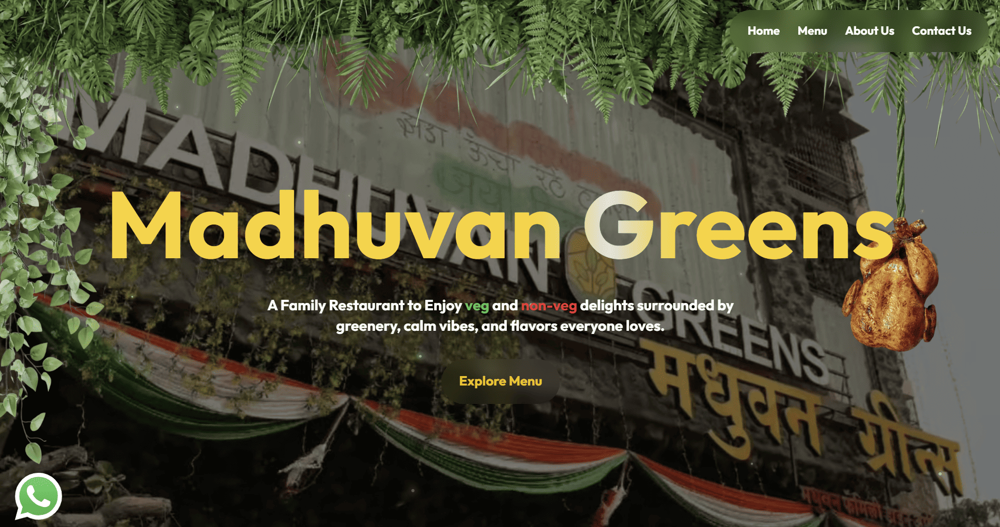

# Madhuvan Greens



A modern, immersive website for Madhuvan Greens, a family restaurant in Badlapur, Maharashtra.

## About

The website introduces the restaurant's family dining experience with a nature-inspired visual design and sections for the menu, team, ambience, desserts, beverages and location.

## Features

- Responsive desktop and mobile navigation
- Animated, immersive restaurant hero section
- Menu, dessert and beverage showcases
- Restaurant ambience and team sections
- Google Maps location embed and WhatsApp contact shortcut
- Privacy Policy and Terms & Conditions pages

## Tech stack

- Next.js
- React
- TypeScript
- Tailwind CSS
- Motion

## Getting started

```bash
npm install
npm run dev
```

Open [http://localhost:3000](http://localhost:3000) in a browser.

## Useful commands

```bash
npm run dev    # start local development
npm run lint   # run lint checks
npm run build  # create the production build
```

## Deploy

Build the production version with `npm run build`, then deploy it to any Next.js-compatible hosting provider.
